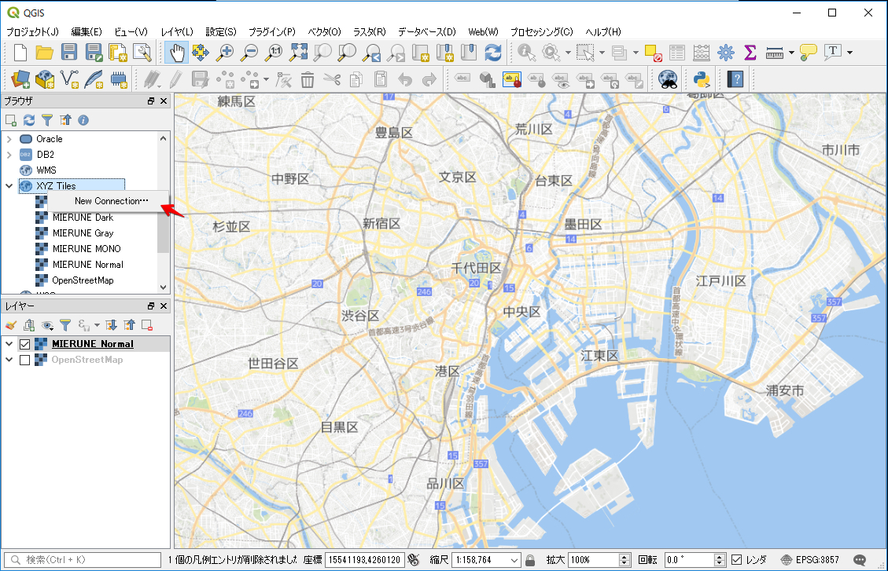
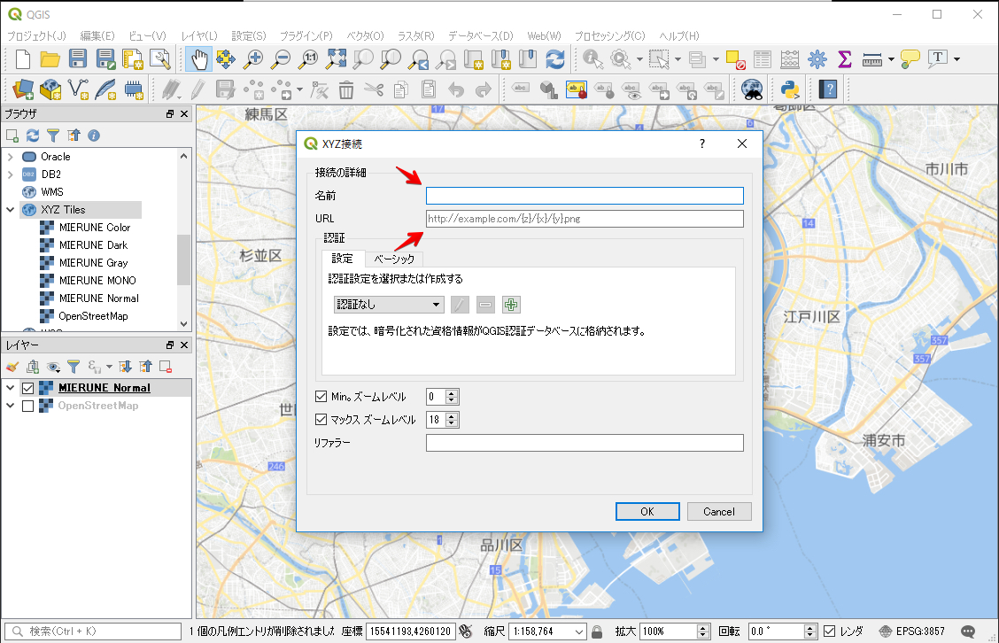
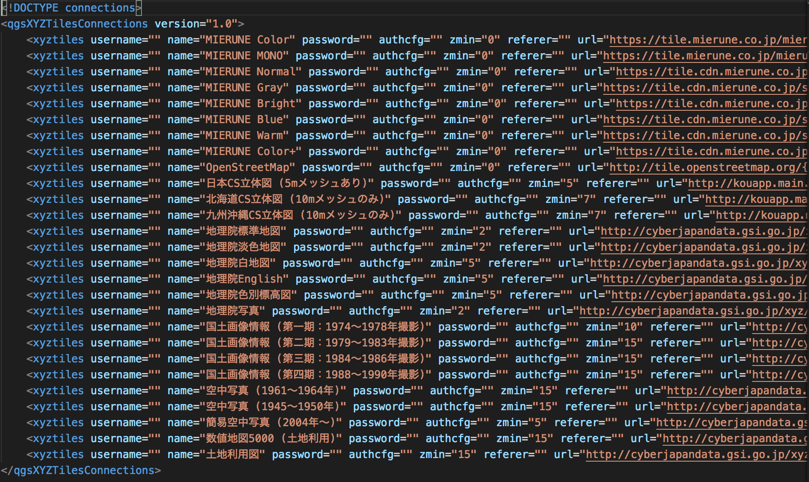
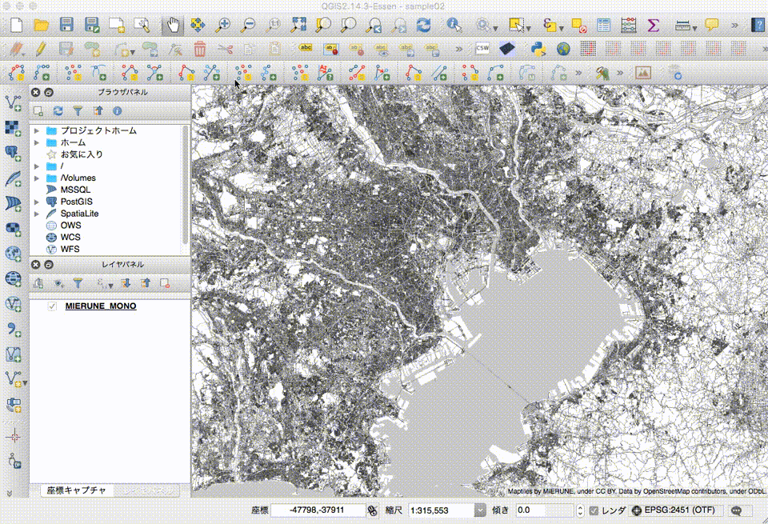
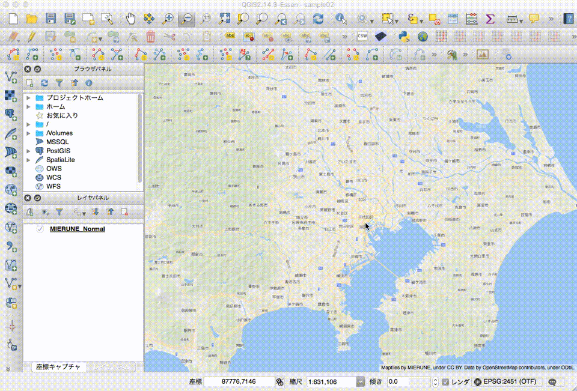

# MIERUNE地図 - QGIS

<br>

## Getting Started

<br>

## XYZ Tiles (QGIS v3.2, v3.0, v2.18)

### MIERUNE地図表示 -「Free」プラン


TileURL
```
https://tile.mierune.co.jp/mierune/{z}/{x}/{y}.png  
https://tile.mierune.co.jp/mierune_mono/{z}/{x}/{y}.png  
```

<br>

---

<br>

### MIERUNE地図表示 -「Standard, Premium, Global Scale」プラン


TileURL
```
https://tile.cdn.mierune.co.jp/styles/normal/{z}/{x}/{y}.png?key=xxxx  
https://tile.cdn.mierune.co.jp/styles/gray/{z}/{x}/{y}.png?key=xxxx  
https://tile.cdn.mierune.co.jp/styles/bright/{z}/{x}/{y}.png?key=xxxx  
https://tile.cdn.mierune.co.jp/styles/blue/{z}/{x}/{y}.png?key=xxxx  
https://tile.cdn.mierune.co.jp/styles/warm/{z}/{x}/{y}.png?key=xxxx  
https://tile.cdn.mierune.co.jp/styles/MIERUNE/{z}/{x}/{y}.png?key=xxxx  
```
- 上記URLにapikeyを追加  


<br>

---

<br>

### 使用方法

単体登録

<br>

1. QGISを起動  

<br>

2. 標準機能の「XYZ Tiles」メニューを右クリック 
 
<br>

3. New Connection実行 


<br>
  
4. 名前とURLを設定 

  
<br>

5. 表示したい地図を選択するとMIERUNE地図が表示

<br><br>

一括登録

<br>




example path
```
./src/tile.xml
```

<br><br>

---

<br><br>


## TileLayerPlugin (QGIS v2.14)

### MIERUNE地図表示 -「Free」プラン



example path
```
./src/MIERUNE_Color.tsv
./src/MIERUNE_MONO.tsv
```

<br>

---

<br>

### MIERUNE地図表示 -「Standard, Premium, Global Scale」プラン



example path
```
./src/MIERUNE Normal.tsv
./src/MIERUNE Bright.tsv
./src/MIERUNE Gray.tsv
./src/MIERUNE Warm.tsv
./src/MIERUNE Blue.tsv
./src/MIERUNE Color+.tsv
```
- tsvファイルにapikeyを追加  


<br>

---

<br>

### 使用方法
1. QGISを起動  

<br>

2. TileLayerPluginをインストール  

 
<br>

3. MIERUNE地図のtsvファイルをダウンロード  

<br>
 
4. 下記ディレクトリにtsvファイルをコピー    
```
/Users/ユーザー名/.qgis2/python/plugins/TileLayerPlugin/layers/  
```

<br>

5. TileLayerPluginを実行  


<br>
  
6. コピーしたtsvファイルが表示されているか確認  

  
<br>

7. 表示したい地図を選択するとMIERUNE地図が表示

