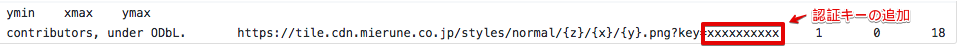

# MIERUNE地図 - QGIS

<br>

## Getting Started

### MIERUNE地図表示 -「Free」プラン


example path
```
./src/MIERUNE_Color.tsv
./src/MIERUNE_MONO.tsv
```

<br>

---

<br>

### MIERUNE地図表示 -「Standard, Premium, Global Scale」プラン


example path
```
./src/MIERUNE Normal.tsv
./src/MIERUNE Bright.tsv
./src/MIERUNE Gray.tsv
./src/MIERUNE Warm.tsv
./src/MIERUNE Blue.tsv
./src/MIERUNE Color+.tsv
```
- tsvファイルにapikeyを追加  


<br>

---

<br>

### 使用方法
1. QGISを起動  

<br>

2. TileLayerPluginをインストール  

 
<br>

3. MIERUNE地図のtsvファイルをダウンロード  

<br>
 
4. 下記ディレクトリにtsvファイルをコピー    
```
/Users/ユーザー名/.qgis2/python/plugins/TileLayerPlugin/layers/  
```

<br>

5. TileLayerPluginを実行  


<br>
  
6. コピーしたtsvファイルが表示されているか確認  

  
<br>

7. 表示したい地図を選択するとMIERUNE地図が表示

